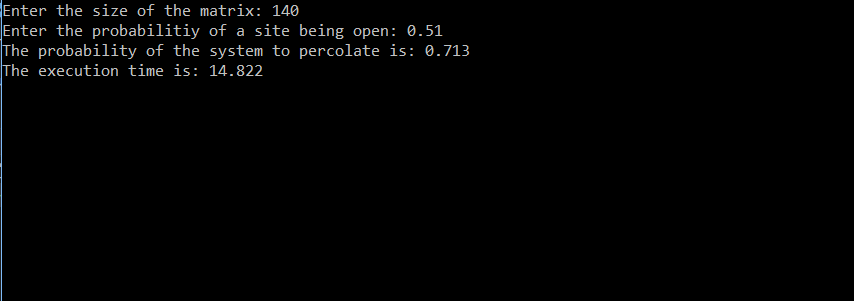
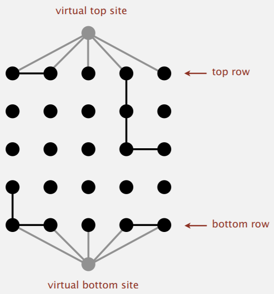

# Percolation-Probability
Calculates the percolation probability of a NxN matrix for a given probability of sites being open by running it 1000 times on randomly generated arrays. 

## Note
This program works by creating two virtual top and bottom sites and linking them to any open upper or lower boundary sites. If there is a change in the bottom site,i.e., if it points to the top site, it means that there is a path from the top site to the lower site to percolate.

Image source: Algorithms (Robert Sedgewick, Kevin Wayne)
